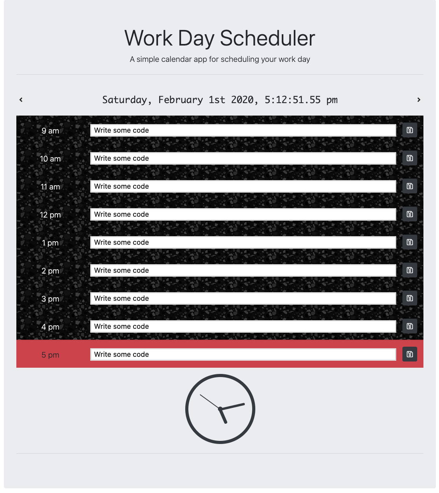

# Day Planner
A basic day planner, front end web app that saves simple schedules to local storage.

## How to Play

You can visit the site [here](https://millernj.github.io/day-planner/). Each day has entries listed from 9 am to 5 pm, and you can save an activity for each hour to your browser. You can also change which day you're looking at with the forward and back buttons next to the date. 

## Development Set Up

This project uses npm for handling it's packages which can be installed with

`npm i`

Once the packages are installed, you can run the project locally with

`npm start`

which will the main html file in your browser and set Sass to watch the project's scss file.